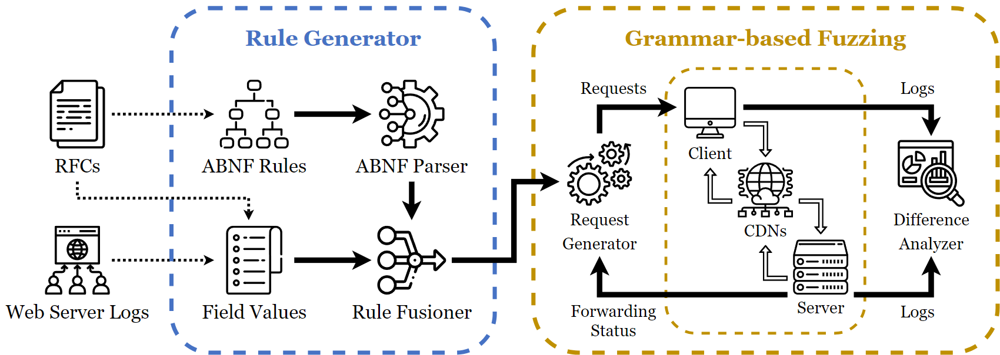

# ReqsMiner

*ReqsMiner* is an innovative fuzzing framework developed to discover previously unexamined inconsistencies in CDN forwarding requests.
The framework uses techniques derived from reinforcement learning to generate valid test cases, even with minimal feedback, and incorporates real field values into the grammar-based fuzzer.

<p align="center">
<kbd>

</kbd>
<br>The Architecture of ReqsMiner.
</p>

## Why build this tool?

ReqsMiner was developed to address the need for a systematic and efficient method to identify forwarding request inconsistencies in Content Delivery Networks (CDNs). Traditional methods of manually discovering these discrepancies may overlook certain variations in forwarding requests, leading to potential security vulnerabilities. 

By automating the process through grammar-based fuzzing with the UCT-Rand algorithm, ReqsMiner can efficiently generate valid test cases and detect differences in CDN forwarding requests with minimal feedback. This tool aims to enhance the security of websites hosted on CDNs by uncovering potential attack vectors, such as DoS attacks, and providing valuable insights to CDN vendors for mitigation.

## How to cite us?

This tool is based on our latest research,"[ReqsMiner: Automated Discovery of CDN Forwarding Request Inconsistencies and DoS Attacks with Grammar-based Fuzzing](https://doi.org/10.14722/ndss.2024.24031)", accepted at [NDSS '24](https://www.ndss-symposium.org/ndss-paper/reqsminer-automated-discovery-of-cdn-forwarding-request-inconsistencies-and-dos-attacks-with-grammar-based-fuzzing/).

If you want to cite us, please use the following (BibTeX) reference:

```bibtex
@inproceedings{zheng24reqsminer,
    year = {2024},
    author = {Linkai Zheng, Xiang Li, Chuhan Wang, Run Guo, Haixin Duan, Jianjun Chen, Chao Zhang, and Kaiwen Shen},
    title = {ReqsMiner: Automated Discovery of CDN Forwarding Request Inconsistencies and DoS Attacks with Grammar-based Fuzzing},
    booktitle = {Proceedings of the 31st Annual Network and Distributed System Security Symposium},
    doi = {10.14722/ndss.2024.24031},
    url = {https://www.ndss-symposium.org/ndss-paper/reqsminer-automated-discovery-of-cdn-forwarding-request-inconsistencies-and-dos-attacks-with-grammar-based-fuzzing/},
    series = {NDSS '24}
}
```

## Installation

- Download this tool
```
git clone https://github.com/Konano/Reqsminer
```

- Install dependencies
```
pip3 install -r requirements.txt
```

> *Python version: Python 3 (**>=3.10**).*

## Usage

#### 1. Configure the origin server 

`server.py` creates a new echo HTTP service that, upon receiving an HTTP request, encodes the original HTTP request into base64 and sends it as a response. To prevent the response from being lost, it also attaches the encoded base64 content to the response header "ReqsMiner". 

| Form        | Description                          |
| ----------- | ------------------------------------ |
| --host      | listening host (default: localhost)  |
| --port      | listening port (default: 8080)       |
| --packet-maxsize | packet maxsize (default: 2048)  |
| --verbose   | verbose mode (default: False)        |

#### 2. Configure the CDN service

For the CDN service to be tested, we need to bind the backend to the HTTP service provided by the origin server.
This step will be different depending on the CDN service provider.
Finally, we get a domain name corresponding to the CDN service for testing (let's call it `test.cdn.com`).

Note: Do not have a reverse proxy (e.g. Nginx) between the CDN and the origin server, as the reverse proxy may modify the request and contaminate the results.

#### 3. Configure the database

`docker-compose.yml` creates a new MongoDB service to store the results of the fuzzing process, which includes the original HTTP text of the test requests before and after they were forwarded by the CDN, as well as the differences detected.

Run the following command to start the MongoDB service:

```sh
docker-compose up -d
```

The default password for root is set in `docker-compose.yml` and for user in `mongo/init-mongo.js`.

#### 4. Configure the client

`client.py` implements the "Request Generator" and "Client" functions of the framework.
It reads `grammar/http.abnf` to generate an HTTP test request and sends it out on a socket to the CDN's test domain.
Then, by parsing the response, the client gets the forwarded request and adds it to the database along with the original request.
Each pair of requests corresponds to a random token.

At the same time, based on the success of the forwarding, the client updates the weights in the ABNF grammar tree, which are used by the UCT-Rand algorithm.
The weights are stored in `data/{HOST}/selector_history`.

The number of rounds and the number of requests per round can be set via parameters.

| Form          | Description                         |
| ------------- | ----------------------------------- |
| -t, --target  | target host (default: localhost)    |
| --thread-num  | thread num (default: 100)           |
| --round-num   | round num (default: 100)            |
| --round-size  | round size (default: 100)           |
| --packet-maxsize | packet maxsize (default: 1024)   |
| --random      | random mode (default: False)        |
| --verbose     | verbose mode (default: False)       |

#### 5. Analyze the results

When the test is finished, use `diff_analy.py` to manually analyze the inconsistencies collected.

| Form         | Description                              |
| ------------ | ---------------------------------------- |
| -t, --target | target host                              |
| -f, --field  | field to be compared                     |
| --type       | type of difference (0-6 / [DiffTypeName](https://github.com/Konano/ReqsMiner/blob/4cdf21d0682b2fa1eba957b3d6811198d6d76a24/src/utils/diff.py#L15))  |
| --quiet      | quiet mode                               |

You can also use `print_request.py` to print the original request and forwarded request.

#### 6. Modify ABNF rules

If you want to set your own ABNF rules, you can add, delete and modify `rfc/*.abnf`, `predefined.json` and `custom.abnf`, which are located in the `grammar/` directory.

Once the files are ready, you can run `python3 src/rule_gen.py` to generate `grammar/http.abnf` and then repeat steps 4 and 5 to the new experiment.

## License

ReqsMiner is a free software and licensed under the [MIT license](/LICENSE).
